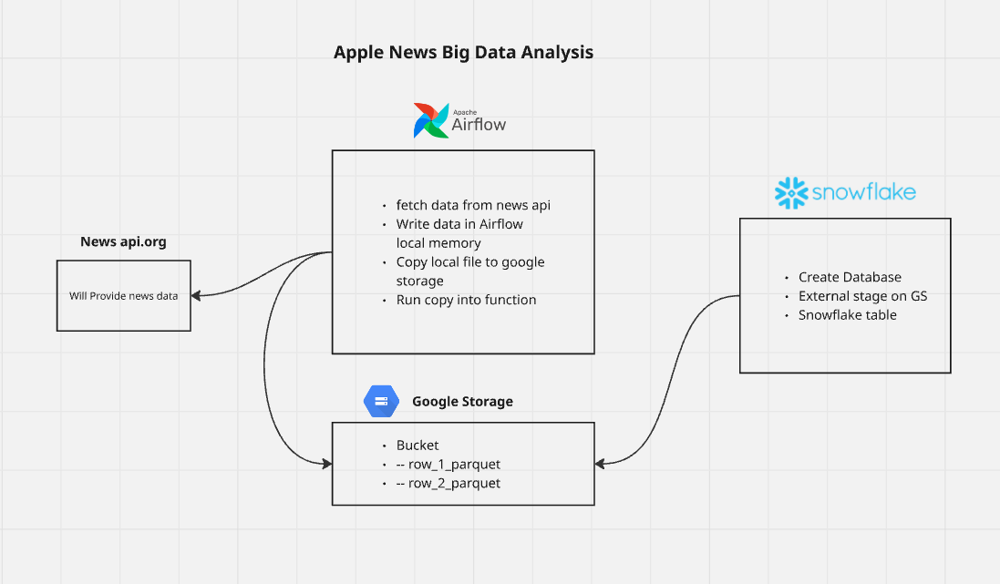

# 🍏 Apple News Data Pipeline Analysis  

This project demonstrates an **end-to-end data pipeline** for ingesting, storing, and analyzing Apple News articles using modern data engineering tools.  

## 🚀 Project Overview  
- **News API**: Provides real-time Apple News data.  
- **Apache Airflow**: Orchestrates the pipeline by scheduling and triggering data fetch jobs.  
- **Google Cloud Storage (GCS)**: Stores the raw news data extracted from the API.  
- **Snowflake**: Ingests data from GCS via an external stage, transforms it, and loads it into structured tables for analysis.  

## 🔄 Workflow  
1. **Airflow Trigger** – Airflow DAG triggers when API sends new data.  
2. **Data Fetching** – News API data is fetched and written temporarily to Airflow’s local memory.  
3. **Upload to GCS** – Data is copied into a Google Cloud Storage bucket.  
4. **Snowflake Stage Creation** – An external stage in Snowflake is created using the GCS bucket.  
5. **Data Loading** – Data from the stage is ingested into Snowflake tables.  
6. **Merging & Transformation** – SQL joins and merges are performed to create clean, structured tables for downstream analysis.  
